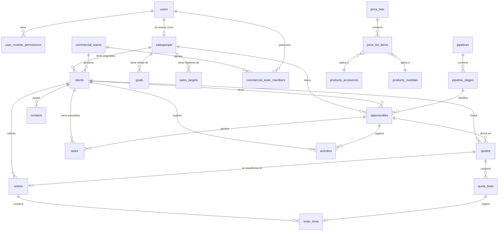

# Plan de Migración de Backend a Golang & Diseño de Base de Datos
Este documento presenta el análisis técnico y el diseño detallado para exportar el backend de Node.js a **Go (Golang)**. El CRM cuenta con un modelo de datos altamente interconectado y un sistema de importación masiva muy flexible.

---

## 1. Resumen de Módulos y Funcionalidades a Migrar

El backend del CRM se compone de **13 módulos clave** que deben reescribirse en Go. A continuación, se detalla qué hace cada uno y cómo interactúa con los demás componentes:

### 1. Dashboard (`/dashboard`)
*   **Métricas del Negocio:** Consume datos de clientes, cotizaciones y oportunidades agrupando por estado.
*   **Plan Comercial (Roles Comerciales):** Separa y calcula métricas en tiempo real para 3 roles de venta (`hunter`, `farmer`, `admin_ventas`):
    *   **Hunters:** Cantidad de llamadas semanales y visitas mensuales realizadas (comparadas con sus metas de la tabla `goals`), y oportunidades comerciales generadas.
    *   **Farmers:** Leads esperando respuesta (tiempo de espera > 2 horas), tiempo de respuesta promedio (diferencia entre `stage_entered_at` y `created_at`), oportunidades activas, tasa de cierre (Won vs. Lost), y oportunidades estancadas (sin actividades registradas en los últimos 3 días).
    *   **Sales Admins:** Cotizaciones pendientes de preparar (`status = 'quote_requested'`), tiempo promedio de entrega de la cotización, porcentaje de entregas a tiempo (≤ 24 hs) y volumen total de cotizaciones emitidas.
*   **Embudo de Ventas (Funnel):** Distribución de oportunidades por etapas del Pipeline.
*   **Estadísticas de Clientes:** Estado de los clientes (Prospecto, Potencial, Final, Inactivo) y conteo de clientes con cotizaciones activas.

### 2. Cotizaciones (`/quotes`)
*   **Gestión Documental:** Creación, edición y eliminación de cotizaciones (`quotes`) y sus líneas (`quote_lines`).
*   **Reglas de Negociación:**
    *   Bloquea la creación de cotizaciones para clientes en estado **Prospecto** (`prospect`), obligando a actualizar sus datos primero.
    *   Autogenera tareas de seguimiento asociadas a la cotización con 3 días de gracia.
    *   Cierra automáticamente las tareas de seguimiento pendientes si la cotización cambia su estado a **Aprobada** (`approved`).
*   **Cálculo de Totales:** Recálculo en cascada de monto neto, peso total en kg (total_kg) y precio promedio por kilo (`avg_price_per_kg`).
*   **Conversión a Pedido:** Proceso transaccional que convierte una cotización y sus líneas en un Pedido de Venta (`orders` y `order_lines`), promueve automáticamente al cliente a **Cliente Final** (`final`) tras registrar su primera Orden de Compra (OC), y cierra todas las tareas de seguimiento de la cotización.

### 3. Pipeline Visual (`/pipelines` & `/opportunities`)
*   **Estructura Dinámica:** Soporta múltiples pipelines con etapas configurables (`pipeline_stages`). Cada etapa almacena su probabilidad de cierre y horas de SLA.
*   **Oportunidades:** Registra transacciones con campos de valor estimado, prioridad, asignación a Hunters/Farmers y productos extraídos.
*   **Trazabilidad:** Monitorea la fecha de entrada a cada etapa (`stage_entered_at`) para el cálculo de SLAs y tiempos de respuesta.

### 4. Tareas (`/tasks`)
*   **Tipos de Tareas:** Soporta llamadas, reuniones, correos, seguimientos y recordatorios.
*   **Asignaciones Múltiples:** Relación N:M administrada por la tabla `task_assignees`.
*   **Control de Postergación:** Registra cuántas veces se aplazó una tarea (`defer_count`), guardando la fecha límite original (`original_due_date`) para auditoría comercial.

### 5. Carga Masiva (`/csv` & `/imports` & `/import-erp`)
*   Motor de importación que procesa archivos en formato CSV. Contiene tres variantes críticas analizadas a fondo en la **Sección 3**.

### 6. Calendario y Sincronización (`/gcal` & `/tasks`)
*   **Integración con Google Calendar:** Sincronización bidireccional de tareas y reuniones. Almacena en la tabla de tareas los campos `google_event_id`, `google_calendar_id` y `google_synced_at` para control de cambios.

### 7. Clientes (`/clients`)
*   **Ciclo de Vida:** Control de transiciones de estados: `prospect` (sin OC) $\rightarrow$ `potential` (alto potencial comercial) $\rightarrow$ `final` (con al menos una OC autorizada) $\rightarrow$ `inactive` (inactivo).
*   **Consumo Anual:** Campo `consumption_scale` en USD que define si un cliente califica como potencial (escala > 0).

### 8. Contactos (`/contacts`)
*   **Relación:** Múltiples contactos por cliente.
*   **Campos de enriquecimiento:** Teléfonos y emails múltiples en formato JSONB, lead scoring automático, perfil de LinkedIn y rol en la empresa.

### 9. Vendedores y Equipos (`/salespeople` & `/commercial-teams`)
*   **Equipos Comerciales:** Estructura modular de equipos (`commercial_teams`) y miembros (`commercial_team_members`) con roles de "vendedor" o "apoyo".
*   **Restricciones de Acceso:** Los vendedores comunes solo pueden ver cotizaciones e historiales de clientes que pertenezcan a su mismo Equipo Comercial.

### 10. Productos y Catálogos (`/products`)
*   **Tres Catálogos Diferentes:**
    1.  `products`: Productos genéricos del CRM.
    2.  `products_accesorios`: Bridas, codos, tees, etc., importados con campos específicos como peso, diámetro, subtipo y norma.
    3.  `products_medidas`: Caños y tubos con dimensiones de diámetro exterior, espesor nominal, tipo de costura y tipo de acero.
*   **Listas de Precios:** Tabla `price_lists` y sus respectivos ítems `price_list_items` asociados a los productos.

### 11. Metas de Actividad (`/goals` & `/sales-targets`)
*   **Metas Operativas (`goals`):** Objetivos temporales (semanales o mensuales) para un vendedor en métricas como llamadas, reuniones, cotizaciones y tasa de cierre.
*   **Objetivos de Facturación (`sales_targets`):** Metas mensuales en montos de divisas (USD/ARS) para facturación aprobada.

### 12. Rubros / Industrias (`/industries`)
*   Catálogo estandarizado de sectores industriales (`industries`) al que se asocian los clientes para análisis sectoriales.

### 13. Usuarios y Permisos (`/users` & `/auth`)
*   **Roles:** Admin, Gerente Comercial, Gerente, Vendedor y Operador.
*   **Seguridad:** Control granular de acceso por módulos almacenado en la tabla `user_module_permissions`.

---

## 2. Esquema de Base de Datos y Relaciones (Modelo ER)

A continuación, se detalla el esquema actual basado en el Drizzle ORM de PostgreSQL. Para simplificar y optimizar, se mapean las claves foráneas explícitas y los tipos de datos recomendados para PostgreSQL.

### Diagrama Entidad-Relación (Mermaid)



---

### Mapeo de Tablas Críticas

#### Tabla: `users`
| Campo | Tipo PostgreSQL | Restricción | Descripción |
| :--- | :--- | :--- | :--- |
| `id` | `SERIAL` | `PRIMARY KEY` | Identificador único del usuario. |
| `username` | `VARCHAR(255)` | `NOT NULL UNIQUE` | Nombre de acceso único. |
| `password_hash` | `TEXT` | `NOT NULL` | Contraseña cifrada con bcrypt. |
| `full_name` | `VARCHAR(255)` | `NOT NULL` | Nombre completo del usuario. |
| `role` | `VARCHAR(50)` | `NOT NULL` | Enum: `admin`, `gerente_comercial`, `gerente`, `vendedor`, `operador`. |
| `is_active` | `BOOLEAN` | `DEFAULT TRUE` | Estado de habilitación. |
| `external_id` | `VARCHAR(100)` | `NULL` | ID de sincronización con ERP externo. |
| `created_at` | `TIMESTAMPTZ` | `DEFAULT NOW()` | Fecha de creación. |
| `updated_at` | `TIMESTAMPTZ` | `DEFAULT NOW()` | Última actualización. |

#### Tabla: `user_module_permissions`
| Campo | Tipo PostgreSQL | Restricción | Descripción |
| :--- | :--- | :--- | :--- |
| `id` | `SERIAL` | `PRIMARY KEY` | Identificador único. |
| `user_id` | `INT` | `REFERENCES users(id) ON DELETE CASCADE` | ID del usuario. |
| `module` | `VARCHAR(100)` | `NOT NULL` | Módulo autorizado (ej: `quotes`, `clients`). |
| `created_at` | `TIMESTAMPTZ` | `DEFAULT NOW()` | Fecha de concesión. |
| *Constraint* | `UNIQUE(user_id, module)` | | Evita duplicar permisos de un módulo por usuario. |

#### Tabla: `clients`
| Campo | Tipo PostgreSQL | Restricción | Descripción |
| :--- | :--- | :--- | :--- |
| `id` | `SERIAL` | `PRIMARY KEY` | Identificador único. |
| `company_name` | `VARCHAR(255)` | `NOT NULL` | Razón social de la empresa. |
| `tax_id` | `VARCHAR(50)` | `NULL` | CUIT/CUIL/RUT. |
| `industry` | `VARCHAR(100)` | `NULL` | Sector o rubro industrial. |
| `phone` | `VARCHAR(50)` | `NULL` | Teléfono corporativo. |
| `address` | `TEXT` | `NULL` | Dirección física. |
| `city` | `VARCHAR(100)` | `NULL` | Localidad / Ciudad. |
| `country` | `VARCHAR(100)` | `DEFAULT 'Argentina'` | País de residencia. |
| `status` | `VARCHAR(50)` | `DEFAULT 'prospect'` | Enum: `prospect`, `potential`, `inactive`, `final`. |
| `assigned_salesperson_id`| `INT` | `REFERENCES salespeople(id)` | Vendedor asignado. |
| `assigned_user_id` | `INT` | `REFERENCES users(id)` | Usuario interno del CRM asignado. |
| `assigned_team_id` | `INT` | `REFERENCES commercial_teams(id)` | Equipo comercial que lo gestiona. |
| `notes` | `TEXT` | `NULL` | Notas adicionales o historial heredado. |
| `consumption_scale` | `NUMERIC(14,2)` | `NULL` | Escala de consumo proyectada en USD. |
| `importance` | `VARCHAR(100)` | `DEFAULT 'ninguna'` | Nivel de urgencia o importancia. |
| `external_id` | `VARCHAR(100)` | `NULL` | ID asignado en el ERP para correlación. |
| `created_at` | `TIMESTAMPTZ` | `DEFAULT NOW()` | Fecha de alta. |
| `updated_at` | `TIMESTAMPTZ` | `DEFAULT NOW()` | Fecha de modificación. |

#### Tabla: `contacts`
| Campo | Tipo PostgreSQL | Restricción | Descripción |
| :--- | :--- | :--- | :--- |
| `id` | `SERIAL` | `PRIMARY KEY` | Identificador del contacto. |
| `client_id` | `INT` | `REFERENCES clients(id) ON DELETE CASCADE`| Cliente al que pertenece. |
| `first_name` | `VARCHAR(150)` | `NOT NULL` | Nombre del contacto. |
| `last_name` | `VARCHAR(150)` | `NOT NULL` | Apellido del contacto. |
| `email` | `VARCHAR(255)` | `NULL` | Email principal. |
| `phone` | `VARCHAR(50)` | `NULL` | Teléfono celular / directo. |
| `position` | `VARCHAR(100)` | `NULL` | Cargo / Puesto laboral (ej: Compras). |
| `is_primary` | `BOOLEAN` | `DEFAULT FALSE` | Indica si es el decisor principal. |
| `notes` | `TEXT` | `NULL` | Observaciones. |
| `linkedin_url` | `VARCHAR(255)` | `NULL` | Perfil de LinkedIn. |
| `photo_url` | `VARCHAR(255)` | `NULL` | Foto de perfil. |
| `emails` | `JSONB` | `NULL` | Lista de emails alternativos (`string[]`). |
| `phones` | `JSONB` | `NULL` | Lista de teléfonos alternativos (`string[]`). |
| `tags` | `JSONB` | `NULL` | Etiquetas del contacto (`string[]`). |
| `lead_score` | `INT` | `DEFAULT 0` | Calificación del prospecto. |
| `source` | `VARCHAR(100)` | `NULL` | Origen del lead. |
| `status` | `VARCHAR(50)` | `DEFAULT 'active'` | Estado (`active`, `inactive`). |
| `created_at` | `TIMESTAMPTZ` | `DEFAULT NOW()` | Alta. |
| `updated_at` | `TIMESTAMPTZ` | `DEFAULT NOW()` | Modificación. |

#### Tabla: `salespeople`
| Campo | Tipo PostgreSQL | Restricción | Descripción |
| :--- | :--- | :--- | :--- |
| `id` | `SERIAL` | `PRIMARY KEY` | Identificador único del vendedor. |
| `user_id` | `INT` | `REFERENCES users(id) ON DELETE SET NULL`| Cuenta de usuario asociada. |
| `name` | `VARCHAR(255)` | `NOT NULL` | Nombre del vendedor. |
| `email` | `VARCHAR(255)` | `NOT NULL` | Email del vendedor. |
| `phone` | `VARCHAR(50)` | `NULL` | Teléfono. |
| `territory` | `VARCHAR(150)` | `NULL` | Territorio o zona asignada. |
| `functional_role` | `VARCHAR(50)` | `NULL` | Enum: `hunter`, `farmer`, `admin_ventas`. |
| `support_user_id` | `INT` | `REFERENCES users(id)` | Usuario de soporte administrativo asignado. |
| `is_active` | `BOOLEAN` | `DEFAULT TRUE` | Activo / Suspendido. |
| `created_at` | `TIMESTAMPTZ` | `DEFAULT NOW()` | Alta. |
| `updated_at` | `TIMESTAMPTZ` | `DEFAULT NOW()` | Modificación. |

---

## 3. Análisis Técnico del Motor de Carga Masiva (CSV)

El actual backend de Node.js implementa tres endpoints cruciales para la importación masiva de datos en formato CSV. Este módulo requiere especial atención para su migración a Go:

### A. Mapeador Flexible (`/imports/execute`)
Este endpoint recibe un archivo CSV genérico junto con un objeto `columnMapping` en formato JSON (por ejemplo: `{"Razón Social": "companyName", "CUIT": "taxId"}`).
*   **Flujo de Ejecución:**
    1.  Parsea el CSV y convierte las filas a un array de objetos planos usando el mapeo definido por el usuario.
    2.  Registra la importación en `import_logs` en estado `processing`.
    3.  Itera secuencialmente fila por fila e invoca funciones específicas de guardado (`importClient`, `importContact`, `importProduct`, `importSalesperson`).
    4.  **Lógica del Contacto (`importContact`):**
        *   **Campos Requeridos:** `firstName` y `clientId` (ID numérico del cliente en la base de datos).
        *   **Campos Opcionales:** `lastName`, `email`, `phone`, `position`, `isPrimary`, `notes`.
        *   **Regla de Deduplicación:** Si el modo es `upsert` o `update` y el contacto tiene un `email` cargado, busca si ya existe un registro con ese correo. Si existe, actualiza los datos; si no existe y está en modo `upsert` o `insert`, inserta el registro.
    5.  Guarda en la base de datos los contadores finales (insertados, actualizados, fallidos) y un JSONB detallado con los errores fila por fila (`errorDetails`) para posterior descarga.

### B. Importador de Seguimientos y Tareas (`/csv/import/client-followups`)
Procesa planillas de novedades comerciales de clientes, buscando cruzar datos y disparar flujos de tareas automatizados.
*   **Campos Requeridos:** `nro_cliente` y `description` (o `novedad`).
*   **Mapeos Inteligentes:**
    *   **Identificación del Cliente:** El valor de `nro_cliente` se compara dinámicamente. Busca en la base de datos por `id` numérico, coincidencia exacta de `taxId` (CUIT), coincidencia exacta de `externalId`, o busca mediante una consulta parcial case-insensitive (`ILIKE`) sobre `companyName`.
    *   **Prioridades:** Si la urgencia contiene la palabra `"alta"`, asigna la prioridad `urgent`. Si contiene `"media"`, asigna `medium`. En cualquier otro caso, asigna `low`.
    *   **Flujo Automatizado por Fila:**
        1. Inserta una tarea (`tasks`) de tipo `followup` en estado `pending`, con vencimiento en la fecha de seguimiento indicada (o 3 días después por defecto).
        2. Inserta una actividad comercial (`activities`) de tipo `follow_up` en estado completado, registrando la fecha del movimiento.
        3. Obtiene la primera regla de seguimiento activa (`followup_rules`) e inserta una entrada en la cola de envíos automáticos (`scheduled_followups`) configurando la fecha programada.

### C. Importador ERP-Aware de la Migración (`/import-erp/:entity`)
Módulo crítico que hereda los encabezados nativos del ERP Traficaño en español y resuelve las relaciones externas de forma dinámica:
*   **Clientes (`Clientes.csv`):**
    *   Mapea los encabezados originales en español: `"Razón social"`, `"Número de cliente"`, `"Número de documento"`, `"Importancia"`, `"Responsable 1"`, `"Responsable 2"`.
    *   Una vez importados los clientes con el externalId del ERP, ejecuta una consulta SQL masiva para cruzar el texto de `"Responsable 1"` con el `fullName` de los vendedores registrados en la base de datos, actualizando de forma masiva el campo `assigned_salesperson_id`.
*   **Cotizaciones (`Cotizaciones de venta.csv`):**
    *   Mapea `"Número"` $\rightarrow$ `number`, `"Cliente"` (nombre comercial en mayúsculas) $\rightarrow$ realiza búsqueda en memoria de clientes por razón social para obtener el `clientId`.
    *   Mapea el campo `"Usuario"` del ERP con el `fullName` de los vendedores para asociar el `salespersonId`.
    *   Convierte estados nativos: `"COTIZADA"` $\rightarrow$ `sent`, `"EN PROCESO"` $\rightarrow$ `draft`, `"CONFIRMADA"` $\rightarrow$ `approved`, `"CONFIRMADA PARCIAL"` $\rightarrow$ `partial`, `"PERDIDA"` $\rightarrow$ `rejected`.
*   **Tareas e Historial Comercial:**
    *   Importa archivos como `Eventos.csv`, `Seguimiento de cotizaciones.csv` y `Carga masiva CRM.csv`.
    *   Utiliza expresiones regulares (`/N[º°o]\s*:?\s*(\d+)/`) en el campo de texto de descripción para extraer el número de cotización del ERP, busca la cotización en la base de datos por su número y asocia automáticamente la tarea a la cotización correspondiente.

---

## 4. Arquitectura Propuesta en Golang (Premium)

Para lograr un backend de alto rendimiento, escalable y fácil de mantener, se propone la siguiente arquitectura para la migración a Go:

```
/crm-backend-go
├── /cmd
│   └── /api
│       └── main.go         # Punto de entrada de la aplicación
├── /internal
│   ├── /auth               # Middleware de autenticación y lógica JWT
│   ├── /config             # Carga de variables de entorno (.env)
│   ├── /database           # Conexión pool a PostgreSQL (pgx)
│   ├── /domain             # Definición de estructuras de datos e interfaces
│   ├── /dashboard          # Lógica, consultas complejas e indicadores de negocio
│   ├── /quotes             # Módulo de cotizaciones y facturas
│   ├── /opportunities      # Pipeline visual y oportunidades de negocio
│   ├── /tasks              # Tareas, recordatorios y gcal sync
│   ├── /clients            # Clientes y contactos
│   ├── /imports            # Motor concurrente de procesamiento de CSVs
│   └── /shared             # Utilidades compartidas (PDF gen, mailer)
├── go.mod
└── go.sum
```

### Stack Tecnológico Recomendado

1.  **Framework HTTP:** **Echo** (`github.com/labstack/echo/v4`)
    *   *Por qué:* Es un framework extremadamente ligero, robusto y rápido. Al estar construido directamente sobre la biblioteca estándar `net/http` de Go, garantiza una compatibilidad del 100% con todos los middlewares y librerías del ecosistema de Go sin necesidad de adaptadores. Ofrece excelente rendimiento y soporte nativo para HTTP/2 de manera transparente.
2.  **Controlador de Base de Datos y Pool:** **pgx/v5** (`github.com/jackc/pgx/v5`)
    *   *Por qué:* Es el driver de PostgreSQL para Go más rápido y seguro del ecosistema. Permite un control preciso de conexiones simultáneas y soporta parsing directo de tipos nativos de PostgreSQL (como arrays y JSONB).
3.  **ORM / Generador de Código de Base de Datos:** **sqlc** (`github.com/sqlc-dev/sqlc`)
    *   *Por qué:* A diferencia de GORM que introduce sobrecarga en tiempo de ejecución, **sqlc** permite escribir código SQL nativo y compila esas consultas en funciones de Go 100% seguras en cuanto a tipos de datos y con rendimiento crudo de base de datos.
4.  **Generación de Archivos PDF (Cotizaciones):** **Maroto** (`github.com/johnfercher/maroto`)
    *   *Por qué:* Es una envoltura sobre `gofpdf` basada en un sistema de grilla (Grid System) muy similar a Bootstrap. Facilita la creación de PDFs complejos con tablas dinámicas de forma limpia y rápida.
5.  **Cifrado de Contraseñas:** `golang.org/x/crypto/bcrypt`

---

## 5. Cambios y Mejoras Propuestas para la Migración

La migración a Go es el momento ideal para corregir limitaciones técnicas del backend de Node.js. Se sugieren los siguientes cambios estructurales:

### A. Migración de Sesiones de Cookie a Tokens Stateless (JWT)
*   **Problema Actual:** El backend usa `express-session` con persistencia en base de datos (`connect-pg-simple`). Esto genera una consulta de lectura I/O en la base de datos por cada solicitud HTTP de la aplicación, limitando la escalabilidad del backend.
*   **Solución Propuesta:** Implementar **JWT (JSON Web Tokens)** en Go. Almacenar información del usuario, rol comercial y permisos del módulo directamente en un token firmado criptográficamente.
*   **Beneficio:** Escalabilidad horizontal inmediata y eliminación de lecturas redundantes en la base de datos para verificar sesiones de usuario.

### B. Motor Concurrente de Procesamiento de CSVs
*   **Problema Actual:** El parser en Node.js recorre las filas del CSV y ejecuta consultas `INSERT/UPDATE` secuencialmente en un bucle simple. Con archivos grandes (>10,000 filas de ERP), la importación bloquea el hilo de ejecución principal o tarda minutos en procesar.
*   **Solución Propuesta:** Utilizar **Goroutines** y canales de Go:
    *   Un goroutine lee y divide el CSV en lotes de filas.
    *   Un **Worker Pool** (ej: 4 workers concurrentes) procesa la validación y transformación de datos en paralelo.
    *   Inserción masiva en base de datos utilizando transacciones agrupadas (`INSERT INTO ... VALUES (...), (...);`) o la herramienta ultra-rápida de copia masiva de PostgreSQL a través del protocolo nativo `pgx.Conn.CopyFrom`.
*   **Beneficio:** Reducción del tiempo de procesamiento de minutos a pocos segundos y cero impacto en la disponibilidad de otros endpoints del servidor.

### C. Normalización y Consistencia de Claves Foráneas
*   **Problema Actual:** Varios esquemas de tablas en Drizzle (`contacts`, `quotes`, `tasks`) tienen campos como `clientId` definidos como enteros simples sin una restricción explícita de clave foránea (`references`) reforzada a nivel de base de datos, lo que expone al sistema a inconsistencias de datos o registros huérfanos.
*   **Solución Propuesta:** Asegurar que en el esquema de base de datos de Go todos los campos relacionales tengan su correspondiente restricción `FOREIGN KEY ... ON DELETE CASCADE / SET NULL` explícita, garantizando la integridad referencial de PostgreSQL.

### D. Uso de Tipos de Datos JSONB Nativos
*   **Problema Actual:** Varios campos complejos en la tabla de contactos (como `emails`, `phones` o `tags` en `contacts`) están guardados como tipo `JSON` plano en lugar de `JSONB`.
*   **Solución Propuesta:** Migrar todos los campos relacionales o colecciones multi-valor que almacenen arrays a **JSONB**.
*   **Beneficio:** PostgreSQL permite indexar campos JSONB (mediante índices GIN), habilitando búsquedas y consultas parciales ultra-rápidas directamente sobre teléfonos o correos electrónicos alternativos del contacto en producción.

### E. Integración de Logs Estructurados
*   *Recomendación:* Usar la librería integrada en Go **slog** (Standard Library Structured Logging). Esto permitirá emitir logs de auditoría en formato JSON para que herramientas de monitoreo puedan clasificar errores de carga de archivos CSV o fallas críticas del sistema de forma automatizada.

### F. Simplificación y Consolidación de Tablas (Reducción de 35 a 30 Tablas)
La migración a Go es la oportunidad de oro para limpiar la base de datos de redundancias acumuladas. Se propone consolidar los siguientes módulos:
1.  **Unificación y Herencia del Catálogo de Productos (Patrón Class Table Inheritance - Entidades Débiles):**
    *   *Problema:* Actualmente existen `products` (legacy/genéricos), `products_accesorios` y `products_medidas` por separado como tablas completamente aisladas. Esto obliga a que tablas comunes como listas de precios, cotizaciones y pedidos manejen relaciones complejas o campos duplicados.
    *   *Solución:* Crear una tabla base `products` (Padre) que contiene los campos compartidos por todos (ID, código ERP, nombre, precios base y tipo de producto). A su vez, crear dos tablas débiles e hijas: `products_accesorios` y `products_medidas`, cuyas claves primarias (`id`) sean a su vez claves foráneas (`FOREIGN KEY`) que apunten a `products.id` con `ON DELETE CASCADE`.
    *   *Beneficio:*
        *   **Relación Directa:** Las cotizaciones y listas de precios se asocian de forma directa a `products.id`, simplificando los joins al 100%.
        *   **Cero Registros en NULL:** Las propiedades de accesorios solo existen en `products_accesorios`, y las de caños en `products_medidas`. No hay columnas vacías ni desperdicio de almacenamiento.
        *   **Integración Súper Limpia en Go:** sqlc genera los structs e interfaces de forma nativa a partir de joins estándar de SQL, facilitando un tipado rígido y seguro.
2.  **Fusión de Tareas y Actividades (2 tablas → 1 tabla):**
    *   *Problema:* Existen las tablas `tasks` y `activities` por separado, con campos casi idénticos. Un "Seguimiento" o "Llamada" planificado es una tarea; una vez concretado, pasa a ser una actividad. Actualmente la carga masiva de CSVs realiza inserciones duplicadas redundantes en ambas tablas.
    *   *Solución:* Fusionar ambas en una única tabla `activities` (o `interactions`) con una columna `status` (`pending`, `completed`, `cancelled`). Una tarea pendiente es simplemente un registro con estado `pending` y `due_date`. Al completarse, pasa a `completed` con su `completed_at`.
3.  **Fusión de Metas Operativas y Objetivos de Venta (2 tablas → 1 tabla):**
    *   *Problema:* `goals` (metas de actividad semanal/mensual como llamadas, visitas) y `sales_targets` (metas mensuales de facturación en dinero) están separadas.
    *   *Solución:* Unificarlas en una tabla `goals` unificada con columnas: `salesperson_id`, `period_type` (`weekly`, `monthly`), `metric_type` (Enum: `calls`, `meetings`, `quotes`, `close_rate`, `revenue`), `target_value` (numeric) y `currency` (nullable para metas de facturación).

### G. Propuestas de Optimización y Rendimiento Corporativo (PostgreSQL + Go)
Para lograr un rendimiento óptimo de nivel empresarial, se recomiendan los siguientes diseños a nivel de base de datos e infraestructura:
1.  **Indexación GIN en Campos JSONB (Búsquedas Multivalor):**
    *   *Detalle:* Crear índices **GIN (Generalized Inverted Index)** sobre las columnas `emails`, `phones` y `tags` en la tabla `contacts`.
    *   *Beneficio:* Búsquedas instantáneas (menos de 1ms) al buscar contactos por teléfonos secundarios o etiquetas, eliminando los *Table Scans* en producción.
2.  **Copia Masiva Nativa de PostgreSQL (`CopyFrom` de pgx):**
    *   *Detalle:* En los importadores de CSVs pesados, utilizar la funcionalidad nativa `pgx.Conn.CopyFrom` de Go en lugar de bucles `INSERT` individuales.
    *   *Beneficio:* Velocidades de inserción superiores a **50,000 registros por segundo**, procesando archivos masivos del ERP en décimas de segundo.
3.  **Vistas Materializadas o Tablas de Agregados para el Dashboard:**
    *   *Detalle:* En lugar de calcular el tiempo de respuesta promedio, tasa de cierre o interacciones estancadas en tiempo real analizando toda la tabla transaccional de actividades, implementar tablas agregadas calculadas asíncronamente en segundo plano (refrescadas mediante un cron job o trabajador en Go cada 30 minutos).
    *   *Beneficio:* El Dashboard comercial cargará de forma instantánea (0ms de latencia en la UI) y la CPU de la base de datos no sufrirá picos.
4.  **Indexación Obligatoria de Claves Foráneas (Foreign Keys):**
    *   *Detalle:* PostgreSQL no indexa automáticamente las claves foráneas. Se deben crear índices B-Tree explícitos en campos relacionales como `quote_lines.quote_id`, `activities.client_id`, `opportunities.client_id`, etc.
    *   *Beneficio:* Elimina bloqueos (*locks*) y escaneos secuenciales innecesicios al borrar o modificar registros padres.
5.  **Soft Deletes (Borrado Lógico Nullable):**
    *   *Detalle:* Implementar un campo `deleted_at` (`TIMESTAMPTZ` nullable) en tablas críticas (`clients`, `contacts`, `products`, `quotes`) en lugar de hacer borrados físicos (`DELETE`).
    *   *Beneficio:* Garantiza la integridad de reportes analíticos históricos y permite restaurar información borrada por error de forma simple.
6.  **Normalización de Moneda en Cotizaciones/Pedidos (Monto USD Base Fijo):**
    *   *Detalle:* Almacenar siempre un campo adicional calculado en el backend llamado `net_amount_usd`. Al crear o editar la cotización, se calcula su equivalencia a USD según el cambio del día y se guarda fijo.
    *   *Beneficio:* Facilita reportes anuales inmediatos de facturación totalizadora sumando directamente la columna `net_amount_usd` sin conversiones de divisa al vuelo en la base de datos.
7.  **Logs de Auditoría en JSONB (Diffs de Cambios):**
    *   *Detalle:* En `quote_logs` y `audit_logs`, almacenar los cambios comerciales como un **Diff estructurado en formato JSONB** (guardando únicamente el estado previo de las columnas que cambiaron y el nuevo estado) en lugar de cadenas de texto verbose.
    *   *Beneficio:* Almacenamiento súper compacto, trazabilidad estructurada y capacidad de revertir cambios (*rollback*) automáticamente.

---

## 6. Funcionalidades Premium Propuestas (Roadmap de Backend)

Aprovechando la migración a Golang y su altísimo rendimiento concurrente, se propone incorporar las siguientes funcionalidades avanzadas en el backend:

### A. Motor de Automatizaciones y Disparadores en Segundo Plano (Rule Engine)
*   **Detalle:** Permitir definir desencadenadores basados en eventos (ej: al aprobar una cotización, enviar automáticamente un correo a logística, mandar un alerta al WhatsApp del vendedor y programar una tarea en 3 días).
*   **En Go:** Utilizar canales (`chan`) y *Goroutines* asínconos para ejecutar todas las acciones en paralelo sin bloquear el hilo web principal.

### B. Flujo Seguro de Aprobación de Descuentos con "One-Click"
*   **Detalle:** Bloquear automáticamente cotizaciones con descuentos superiores a la regla de negocio (ej: >5%), notificando al gerente con un token JWT firmado de un solo uso.
*   **En Go:** El gerente aprueba o rechaza el descuento mediante botones directos en su correo sin necesidad de iniciar sesión en la plataforma en el celular.

### C. Sincronización en Tiempo Real mediante WebSockets
*   **Detalle:** Establecer conexiones WebSockets bidireccionales nativas con Echo.
*   **En Go:** Permite reportar el porcentaje exacto de avance de las cargas masivas en tiempo real e interactuar de forma instantánea sobre el tablero Kanban del pipeline entre múltiples comerciales conectados.

### D. Compilación y Caché de PDFs en Segundo Plano (S3 Cache)
*   **Detalle:** Compilar PDFs comerciales asíncronamente con la librería Maroto y subirlos a almacenamiento en la nube (AWS S3/MinIO), invalidando la caché únicamente si hay cambios en el registro.
*   **En Go:** Elimina los tiempos de espera del navegador y ahorra memoria al delegar la compilación fuera del ciclo de petición HTTP ordinario.

### E. Daemon de Sincronización Asíncrona Bidireccional con el ERP Traficaño
*   **Detalle:** Servicio en segundo plano (*Go Daemon*) que consulta la API o base de datos del ERP cada 10 minutos y actualiza el CRM automáticamente.
*   **En Go:** Emplea colas locales en memoria con reintento exponencial (*exponential backoff*) ante caídas de conexión, asegurando tolerancia a fallos absoluta.


